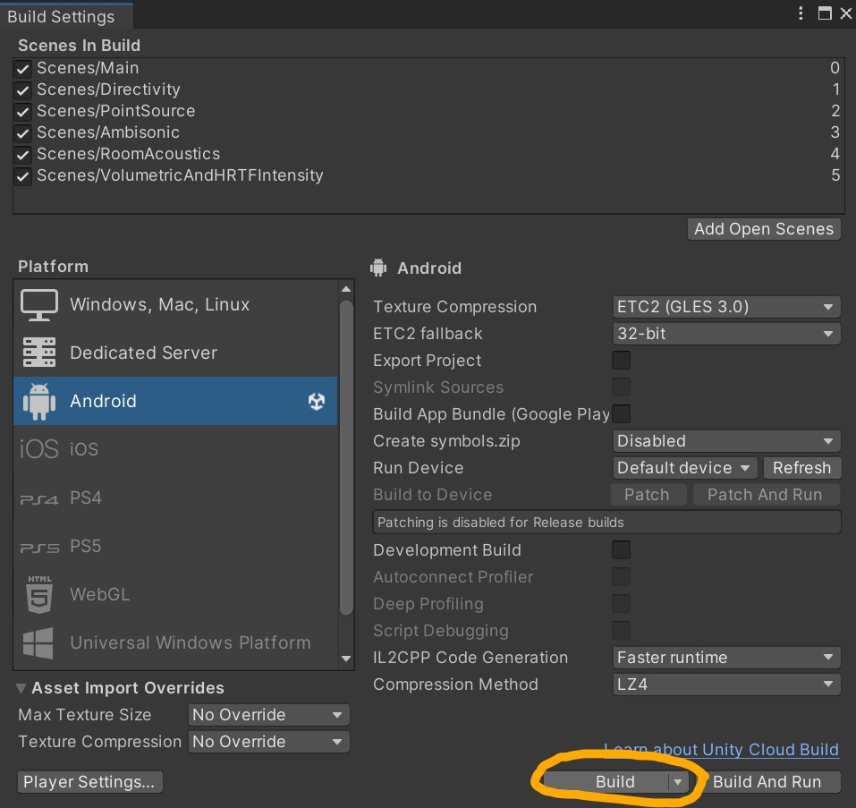

# LICENSES

The Unity-MetaXRAudioSDK repository including all packages and SDKs, is released under the Oculus SDK License.  You may obtain a copy of the SDK License at https://developer.oculus.com/licenses/oculussdk/

Helicopter audio samples are sourced from https://github.com/viktorphoenix/fieldrecordings-ccby4.  The License for the helicopter audio samples can be found in the third-party folder.

# Repository Content

An overview for using Meta's Presence Platform Audio SDK in Unity can be found [here](https://developer.oculus.com/documentation/unity/meta-xr-audio-sdk-unity-req-setup/). Each project in this repository contains a **Main** scene that can be used in playmode to run through the various audio feature experiences. It's suggested to use Oculus Link when in the Unity Editor. Instructions for using Oculus Link can be found [here](https://developer.oculus.com/documentation/unity/unity-link/).

* [**MetaXRAudioSDK**](./MetaXRAudioSDK/) - This Unity project uses the [Unity Package Manager (UPM)](https://docs.unity3d.com/Manual/Packages.html) friendly version of [Meta's Presence Platform SDKs](https://developers.facebook.com/blog/post/2023/04/25/presence-platform-overview/).

# Project Compilation

## Prerequisites
The projects in this repository can be be compiled and installed onto Developer Mode Enabled Quest devices. Instructions for enabling developer mode on your Quest device can be found [here](https://developer.oculus.com/documentation/native/android/mobile-device-setup/#enable-developer-mode).

## Building
Unity documentation for building Android applications can be found [here](https://docs.unity3d.com/Manual/android-BuildProcess.html). Instructions for building projects in this repository are provided below:

1. Open the project of interest in a Unity Editor.

1. Open the [**Build Settings**](https://docs.unity3d.com/Manual/BuildSettings.html) window via the Unity Editor toolbar (**File -> Build Settings**).

1. Select the **Android** platform in the [**Build Settings**](https://docs.unity3d.com/Manual/BuildSettings.html) window and press **Build** to compile an Android APK.

    


## Running
1. Install the compiled apk to your Quest device with [adb](https://developer.android.com/tools/adb):
    ````
    adb install path/to/your/apk/MetaXRAudioSDK.apk
    ````

1. Open the application through your Quest device's App Library. The application will likely be listed under the **Unknown Sources** section.
